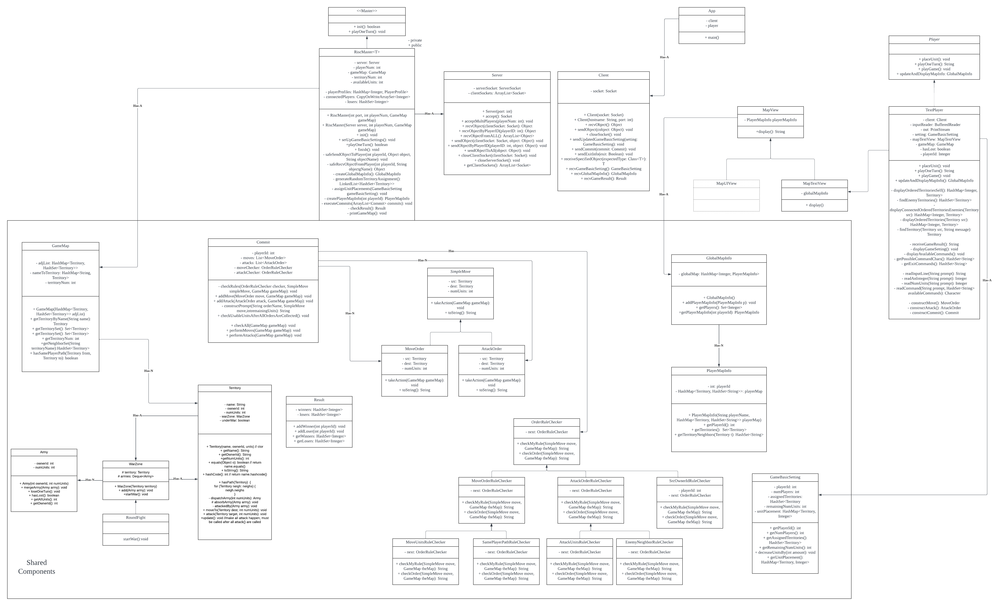

# ece651-spr23-team6-risc
========================================

The code in this project is for a web service - RISC board game

This project includes CI/CD using Duke's Gitlab and Duke's VM.

Maintainer: ece651-spr23-team6

[](https://gitlab.oit.duke.edu/mw515/ece651-spr23-team6-risc/-/commits/main)

[](https://gitlab.oit.duke.edu/mw515/ece651-spr23-team6-risc/-/commits/main)

[Detailed coverage](https://mw515.pages.oit.duke.edu/ece651-spr23-team6-risc/dashboard.html)


## Usage
```bash
# client ui developing..
./gradlew run-client # to launch the GUI scene
```

```bash
./gradlew build
./gradlew installDist

launch server: ./server/build/install/server/bin/server <server_port>
launch client: ./gradlew run-client

# Text version

# e.g., vcm-30756.vm.duke.edu 12345
```

### Some useful tips during development
```bash
git push -o ci.skip # not run any CI pipelines on this push
```

```bash
./gradlew (clean) build
./gradlew run-client # to see an example launching a JavaFX stage
```

### Note
[Download](https://gluonhq.com/products/javafx/) JavaFX SDK if it's not included in your Java SDK

### Resources
- [JavaFX-tutorial](https://jenkov.com/tutorials/javafx/3d.html)
